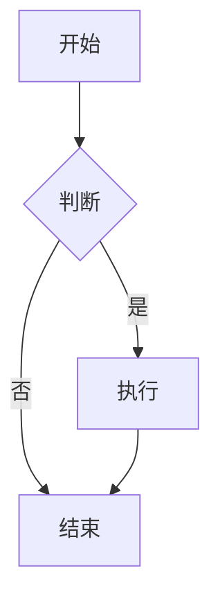

# Mermaid 文本绘图

在笔记里用 `mermaid` 代码块书写图表文本，预览时自动渲染为矢量图。支持流程图、时序图、类图、状态图、甘特图、思维导图等。

## 用法

在任意笔记中插入：

````markdown

````

切到「预览」或「分屏」即可看到渲染后的图。

## 特性

- 宿主仅提供「预览代码块渲染」扩展点，本插件自带 `mermaid` 库（`vendor/mermaid.min.js`），离线可用，不依赖宿主打包。
- 渲染失败会在代码块位置显示错误提示，方便修正语法。
- 卸载插件后，`mermaid` 代码块回退为纯文本，不影响笔记内容。

## 权限

仅需 `ui:preview`（声明负责渲染预览中的 `mermaid` 代码块）。

## 扩展说明

本插件是「宿主开放预览扩展点、具体能力由插件自带」设计范式的示例。
后续若要支持 PlantUML、Cytoscape 等，只需新建插件、自带对应库并调用
`api.ui.registerCodeBlockRenderer({ lang, render })`，无需改动宿主代码。
